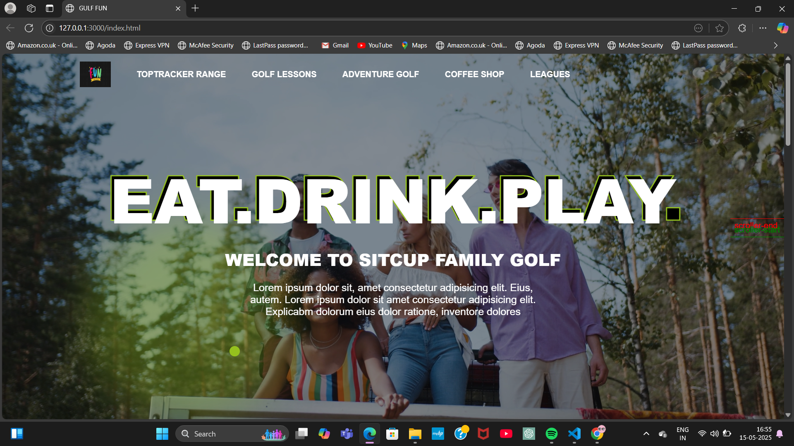

# ⛳ Golf Fun Website Clone

Welcome to the **Golf Fun Website Clone**!  
This is a responsive and interactive landing page focused on the theme of playing golf and having fun. It features smooth animations using **GSAP** and dynamic interactions built with **JavaScript**, along with clean **HTML** and modern **CSS** styling.

## 🚀 Features

- Fully responsive layout
- Smooth animations using [GSAP (GreenSock Animation Platform)](https://greensock.com/gsap/)
- Interactive UI components built with JavaScript
- Visually appealing golf-themed design
- Simple and clean code structure

## 🎯 Technologies Used

- **HTML5** — Markup structure  
- **CSS3** — Styling and layout  
- **JavaScript** — Functionality and interactivity  
- **GSAP** — Advanced animations and transitions  

## 📸 Preview

<!-- Add your website demo link or screenshot below -->
  
🔗[Live Demo] : (https://gulf-play.netlify.app/)


## ⚙️ How to Use

1. **Clone the repository**  
   ```bash
   git clone https://github.com/yukti-says/Fun-Gulf_website


